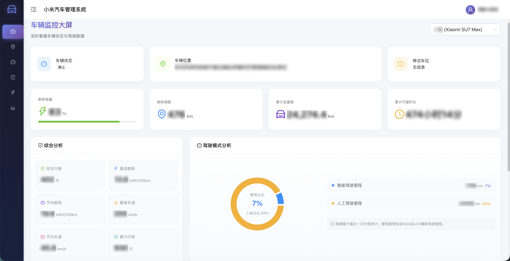
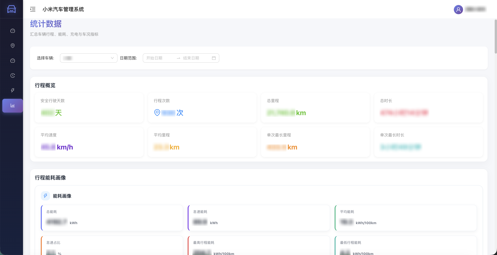
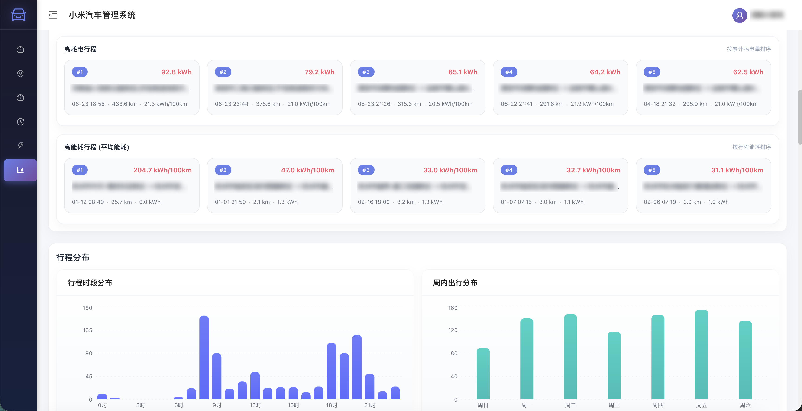
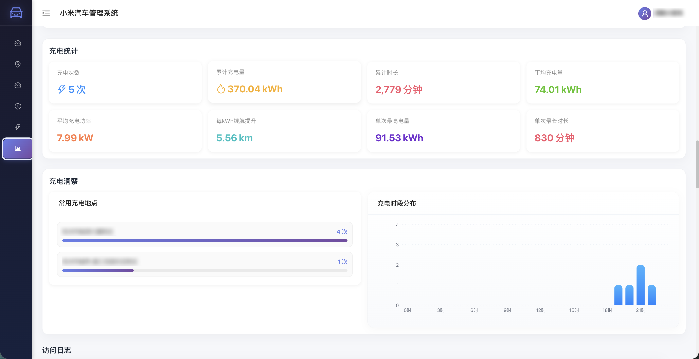
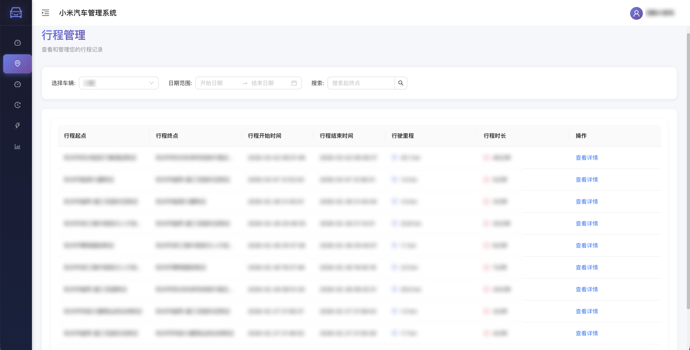
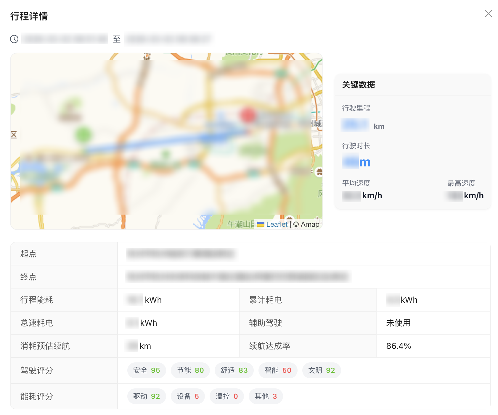
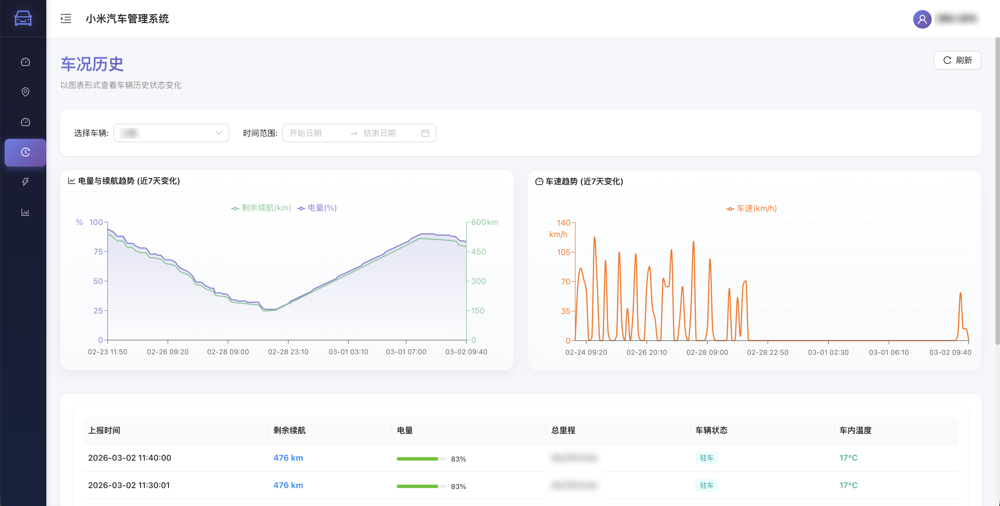
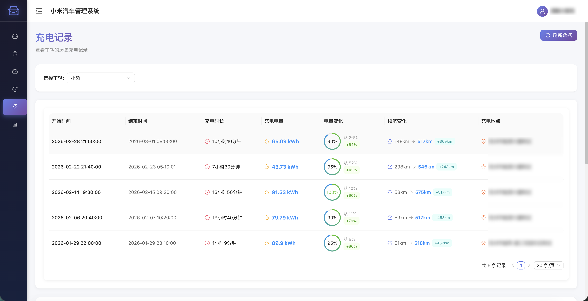
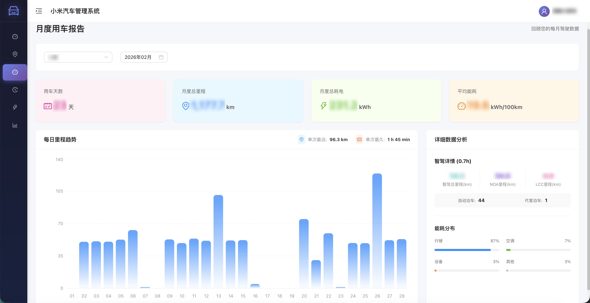
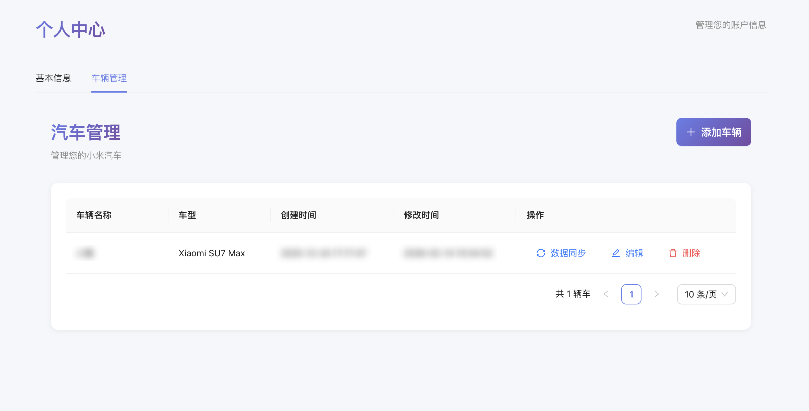

# 小米汽车 Mate 使用教程（快速上手）
面向小米汽车数据管理的前后端服务，提供车辆管理、行程分析、充电分析、状态趋势、综合统计与日志分析能力。

## 快速入口

| 场景 | 跳转 |
| --- | --- |
| 默认账号 | [首次启动与默认账号](#1-首次启动与默认账号) |
| 部署方式 | [部署方式](#2-部署方式) |
| 账号配置 | [登录与小米账号配置](#3-登录与小米账号配置) |
| 抓包说明 | [小米账号信息获取（抓包）](#4-小米账号信息获取抓包) |
| 添加车辆 | [添加车辆](#5-添加车辆) |
| 数据同步 | [数据同步](#6-数据同步) |
| 常见问题 | [常见问题](#7-常见问题) |
| 临时体验提示 | [临时体验提示](#临时体验提示) |

## 部署建议与免责声明

- 推荐在**私有环境**部署（如 NAS / 家庭服务器 / 个人云主机），避免暴露在公网。
- 本项目仅用于个人学习与数据管理，请遵守当地法律法规与小米服务协议。
- 因使用本项目导致的账号风控、服务异常或数据损失等风险，请自行承担。
- 部分参数需通过抓包获取，需具备基本抓包能力并自行承担相关风险。

## 1. 首次启动与默认账号

系统首次启动时，会自动创建管理员账号：

- 用户名：`admin`
- 密码：`admin`

首次登录后请立即修改密码。

## 2. 部署方式

### 2.1 方式一：直接使用 `docker-compose.yml`（需要手动初始化 SQL）

1. 启动服务：

```bash
docker compose -f docker-compose.yml up -d
```

2. 手动初始化数据库：

```bash
docker exec -i xiaomiev-postgres psql -U postgres -d xiaomi_ev < initdb/01_init.sql
```

> 提示：需要在 `docker-compose.yml` 中手动修改 `DB_PASSWORD`。

> 前端访问地址：http://localhost:18080
> 
### 2.2 方式二：脚本一键部署（自动初始化 SQL）
```bash
git clone git@github.com:Ponyix/xiaomiev-mate-public.git
cd xiaomiev-mate-public
cp .env.example .env
chmod +x deploy.sh
./deploy.sh
```

首次部署前请在 `.env` 中修改 `DB_PASSWORD`。

脚本会做三件事：

1. `docker compose up -d` 启动服务
2. 等待 PostgreSQL 健康
3. 若数据库未初始化，则自动执行 `initdb/01_init.sql`

> 注意：脚本依赖 `docker-compose.yml` 和 `initdb/01_init.sql` 同目录存在。  
> 如果数据库已初始化，会自动跳过 SQL 执行。

## 3. 登录与小米账号配置

进入 Web 端“个人中心”，填写小米账号信息并点击 **“测试获取Token并保存”**。

必填字段：

- `小米用户ID`
- `小米登陆账号`
- `小米登陆密码`（输入明文密码，后端会自动处理）
- `EUI`
- `常用设备ID` 

说明：
- 如果返回提示 **“触发验证码，请确认设备ID。”**，说明设备风控触发，需要检查 `常用设备ID` 是否正确。
- 如果返回提示 **“小米信息错误”**，说明参数不完整或抓包内容不正确。

## 4. 小米账号信息获取（抓包）

目前小米账号参数需要通过抓包获取，步骤建议如下：

1. 使用抓包工具（例如 Charles、Fiddler、mitmproxy）对手机网络进行代理。
2. 打开小米汽车 App 并执行登录或刷新车辆信息操作。
3. 在请求中查找以下字段并记录：

- `小米用户ID`（通常对应接口中的 `cUserId`）
- `常用设备ID`（请求头或参数中的DeviceId ID）
- `Eui`（请求头中的 `EUI`）
- `车辆ID`（vid 车辆唯一 ID，后续添加车辆时必填）

将这些信息填写到“个人中心”，完成保存。

## 5. 添加车辆

在“车辆管理”中添加车辆：

- `车辆ID` 必填（需通过抓包获取）
- `车型` 必填（需匹配车型列表）

如果提示“小米账号信息不完整”，请先完成第 3 步配置。

## 6. 数据同步

首次部署建议先执行一次“同步全部历史行程和月度行程报告”，用于补齐历史数据。

路径：个人中心 -> 车辆管理 -> 数据同步

三个按钮说明：

1. 同步当天行程  
   程序日常会自动同步行程，此按钮属于“补偿机制”，用于在自动同步未及时获取到当天行程时手动补齐。

2. 同步全部历史行程和月度行程报告  
   拉取“当前车辆”的历史行程，并同步历史月度行车报告（适合首次部署或补全历史）。

3. 同步上月行车报告  
   一般用于月初行车报告数据不完整时的补偿机制。

行程同步机制：
在行车结束后几分钟内会同步到数据，若遇到小米侧生成延迟或网络波动，可使用“同步当天行程”进行补偿。

注：行程数据在小米汽车侧 2025 年 3 月上线，最早仅能获取到 2025 年 3 月份之后的数据。

## 7. 常见问题

1. 获取 Token 失败：
    - 请确认抓包字段是否完整
    - 检查设备 ID 是否正确

2. 触发验证码：
    - 更换或修正 `常用设备ID`
    - 重新抓包确认 `EUI`

3. 无法拉取车辆：
    - 确认车辆 ID 已添加
    - 确认小米账号信息已保存

4. 为什么项目暂不开源？
    - 当前小米登录需要通过抓包获取关键参数与 token，目前无法解决该问题，因此项目暂不开源。
    - 如果你有更好的实现思路或对项目感兴趣，欢迎联系邮箱 `mkx3887@gmail.com` 一起共创与交流。

## 临时体验提示

如果仅做临时体验，建议 **24 小时内删除容器与数据**，避免敏感信息残留：

```bash
docker compose -f docker-compose.yml down
rm -rf pgdata logs
```
## 截图预览











